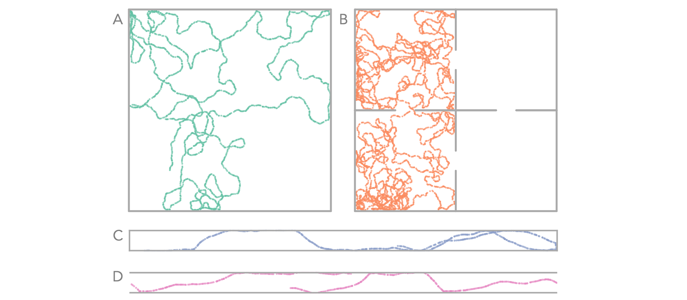
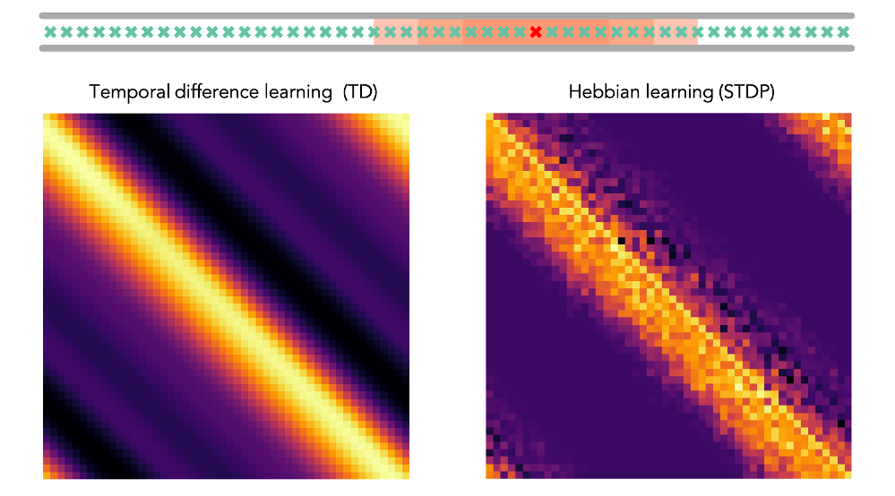
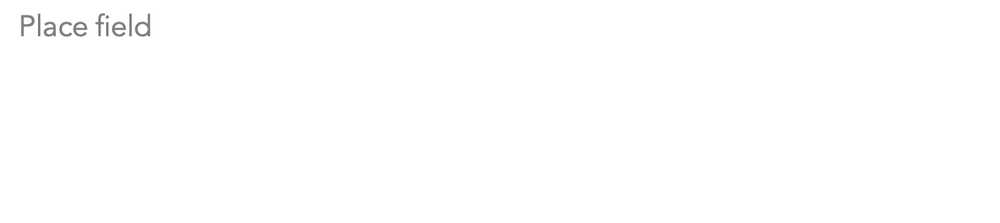

# STDP-SR
## Hebbian learning approximates successor representations in hippocampus

### Introduction 
Successor representations (these papers by [Stachenfeld](https://www.nature.com/articles/nn.4650) and [de Cothi](https://onlinelibrary.wiley.com/doi/full/10.1002/hipo.23246) make for good prereading) are probably learnt in hippocampus to assist navigation algorithms. They store compressed information about future state occupancy, under a given policy, starting from the current state. They are mathematically well defined and they (as well as the navigation algormiths they support) explain much behavioural and anatomical evidence. Like typical `value functions' in reinforcement learning, it is usually assumed that these successor representations are learned by error-based temporal difference (TD) update steps however the implementation of this mechanism in hippocampus has not been studied extensively and is probably biologically implausible. 

Here we propose, build and test a fundamentally different mechanism for learning successor representations based on standard Hebbian learning. 

As an animal moves through the environment place cells in hippocampus, centred at points along the chosen path, fire sequentially. By binding cells in this sequence according to rules of spike timing dependent plasticity a close approximation to the SR is learnt in the binding weights. Broadly speaking if cell A always fires before cell B in a sequence there will be a strong binding weight from A to B learn according to the rules of STDP. It so happens that the successor feature for location B, starting at location A is also high under the current policy (location A implies you are likely to soon be at location B). A similar story holds for cell C which will bind less trongly to A as their firing is seperated further in time but will also have a lower successror feature under the current policy. 

Though the Hebbian weight matrix doesn't strictly converge to the true SR we show the approximation is close, sufficiently so to reproduce know features of place cells derived from the weight matrix. Additionally along-path cell firing is likely too far seperated in time for STDP (known to have a very short plasiticity window) ot bind them. This is solved by theta precession, know to cause rapid theta sweeps over the local trajectory. These sweeps occur much faster than the trajectory is actually traversed, fast enough to bring successive spike timing within the STDP window. A trivial model of theta phase precession and therefore theta sweeps is implemented in our code. 

### Code summary 
`class MazeAgent()`  initialises an agent within a maze, built up of walls. In side the maze is an agent who,  following a policy, can explore the maze. The agent is popluated with a large number of 'basis cells' who's firing rate is determined by the location within the maze. Typically these have large gaussian receptive field but they could be one-hot. These population firing vecotor of these cells forms the basis of the learning rules which (through temporal difference learning or, as we aim to show, hebbian learning) learn the successor feature matrix. Shown here is walking around at 0.16m/s, for 100 seconds. The policy is pseudorandom walk (with momentum) with a mild preference to follow, rather than collide with, the walls. This figure shows 4 of the potential maze designs and the path of the agent moving around the maze: (A) a large 2D room, (B) a four compartment room with open and closable doors, (C) a 1D maze, (D) a 1D loop (the gent is teleported to the otherside when it crosses an end

Following the last 'loop' example, below shows the location of 50 large basis feature-cells placed alongd along the track (red cell receptive field shown in full for scale). The figure below this, on the left, shows the successor matrix learnt by TD learning. On the rgiht is the STDP weight matrix (i.e. `approximate SR matrix').  

The final figure shows the result of using this successor feature matrix to define 'place cells'. Notice that, like with real place cells, they start to skew against the direction of travel. 

