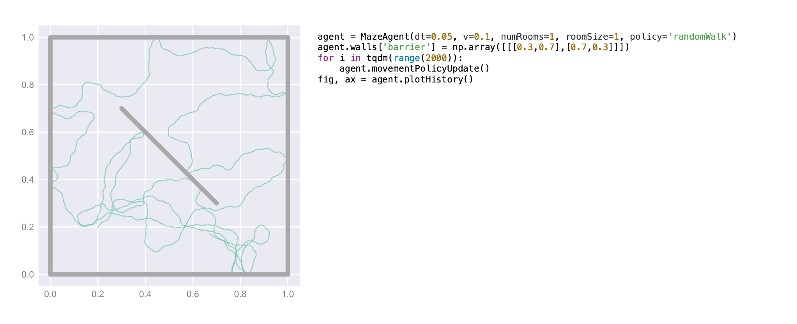
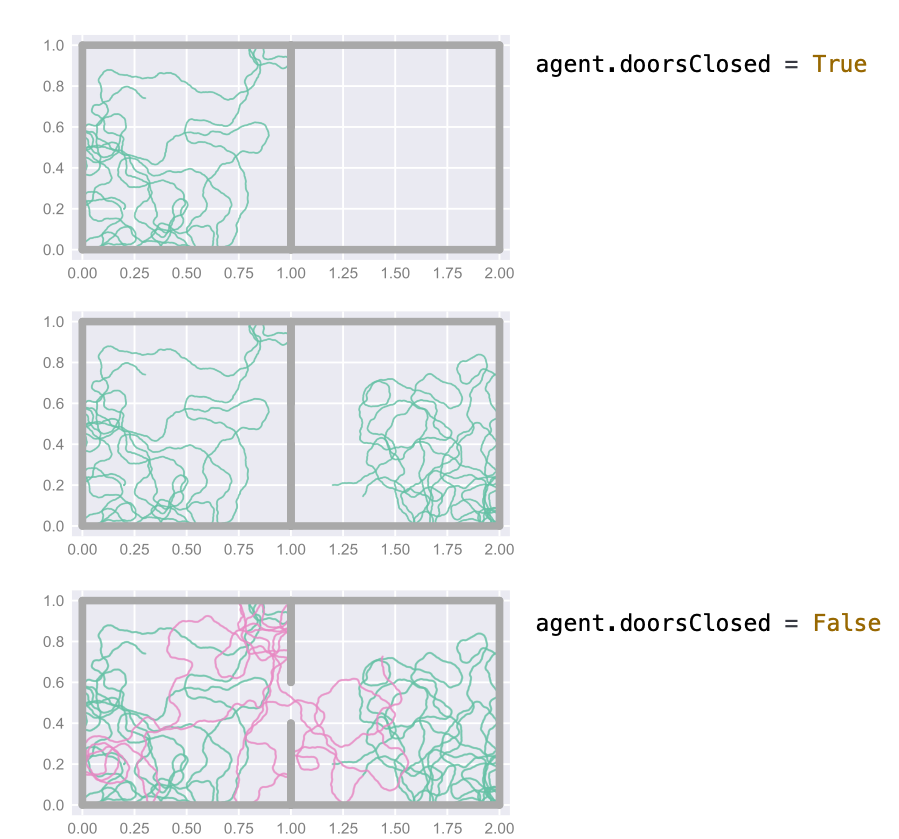
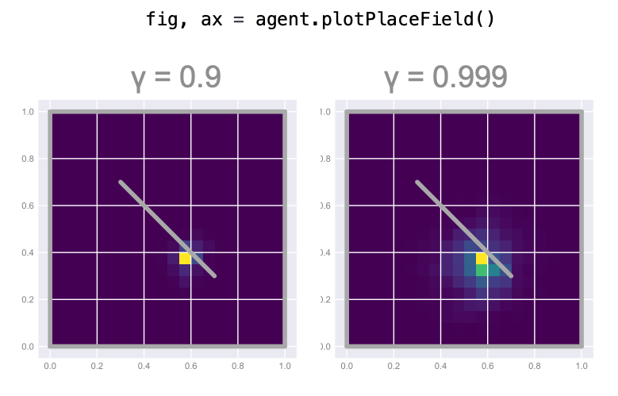
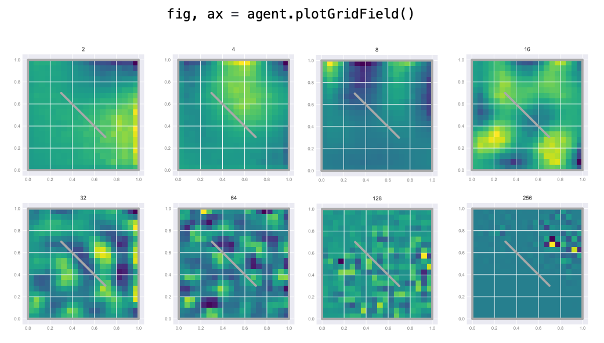

# CompositionalMazes

`class MazeAgent()`  initialises an agent within a maze, built up of walls. The agent, following a policy, can explore the maze. Here he is walking around at 0.1m/s, for 100 seconds. Under the current policy, when a wall collision is detected, the agent bounces off the wall elastically. 

The maze can be compositional, made up of multiple compartments connected by doors which can be opened or closed. 

Importantly it is not a grid world - instead the maze (and correspondingly, the agent's position) is continuous. The position is mapped to a (potentially quantised) state representation as and when needed by the function `agent.positionToState()`. This state respresentation could be a one-hot representation, or could be more complex, built from place fields or boundary vector cells. The agent learns a successor representation on this state representation as it explores the maze. This gives rise to place fields (the columns of the successor matrix) and grid cells (the eigenvectors of the successor matrix). 

